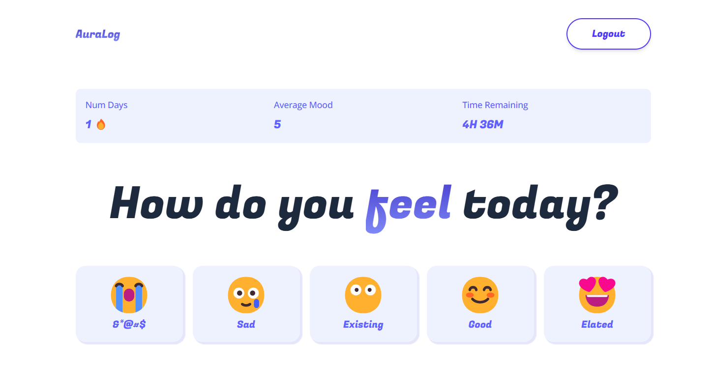
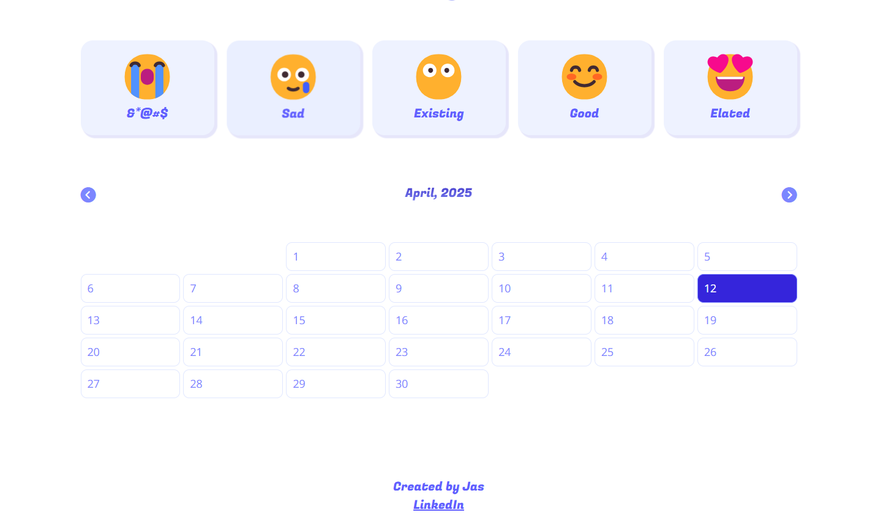
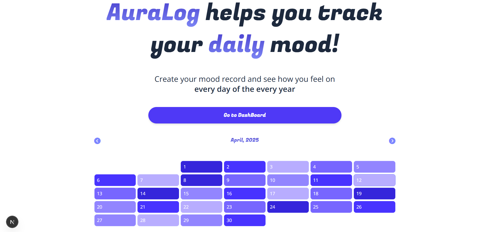
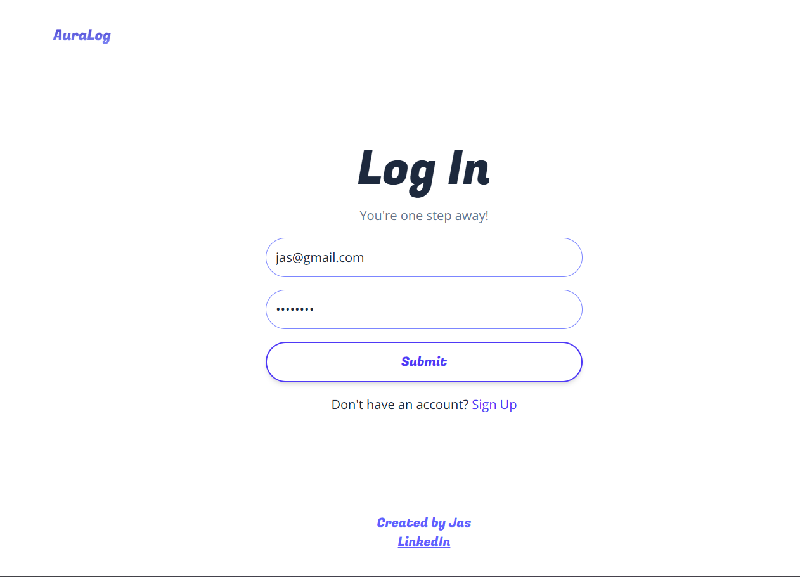

# ✨ AuraLog: Track Your Moods, One Day at a Time ✨

<p align="center">
  
  
  
  
</p>

---

> **AuraLog** helps you track your **daily moods** beautifully through **emojis** and a **color-coded calendar**.  
> Log your feelings, visualize trends, and reflect on your emotional health over time.

---

## 🧪 Live Demo

Curious to try it out before cloning?

👉 **[Check out the live app here](https://wondrous-gaufre-8af8d3.netlify.app/)**
No sign-up needed to explore — just use the **Demo Mode Calendar** on the home page!

---


## ✨ Features

- 🔐 **User Authentication** (Sign Up, Log In, Log Out)
- 😄 **Mood Logging** via emoji selection
- 📅 **Monthly Mood Calendar** view
- 📊 **Statistics Dashboard** (Days tracked, Average mood, Time remaining today)
- 🖌️ **Modern Responsive UI** (TailwindCSS + FontAwesome)
- 🔥 **Real-Time Data Sync** with Firebase Firestore
- 🎨 **Demo Mode Calendar** for new users

---

## 🚀 How It Works

1. **Authentication**  
   → Uses Firebase Authentication for email/password login/signup.

2. **Mood Logging**  
   → Select an emoji to log how you feel. Mood data is saved locally and to Firestore.

3. **Mood Calendar**  
   → View your mood every day of every month! Color-coded by how you felt.

4. **Stats Tracking**  
   → Dashboard shows total days logged, average mood score, and time left in the day.

---

## 🖼️ Live Preview

### 🎯 Dashboard - Mood Logging + Stats



---

### 🎯 Dashboard - Calendar Mood Tracker



---

### 🏡 Landing Page - Home + Demo Calendar



---

### 🔐 Login Page



---

## 📂 Project Structure

```
AURALOG/
├── app/
│   ├── dashboard/
│   │   └── page.js         # Dashboard route
│   ├── favicon.ico
│   ├── globals.css         # Global styles
│   ├── head.js             # Head component
│   ├── layout.js           # Layout component
│   └── page.js             # Landing page
│
├── components/
│   ├── Button.js
│   ├── Calender.js
│   ├── CallToAction.js
│   ├── Dashboard.js
│   ├── Hero.js
│   ├── Loading.js
│   ├── Login.js
│   ├── Logout.js
│   └── Main.js
│
├── context/
│   └── AuthContext.js      # Authentication context
│
├── utils/
│   └── index.js            # Gradients, base mood ratings, demo data
│
├── public/
│   └── (Static assets)
│
├── .env                    # Environment variables (Firebase keys)
├── .gitignore
├── eslint.config.mjs
├── firebase.js             # Firebase initialization
├── jsconfig.json
├── next.config.mjs
├── package-lock.json
├── package.json
├── postcss.config.mjs
└── README.md
```

---

## 🚀 Getting Started

1. **Clone the Repository**

   ```bash
   git clone https://github.com/Arbiter09/AuraLog.git
   cd AuraLog
   ```

2. **Install Dependencies**

   ```bash
   npm install
   ```

3. **Set Up Firebase**

   - Create a Firebase project at [Firebase Console](https://console.firebase.google.com/)
   - Enable **Email/Password Authentication**
   - Set up a **Firestore Database**
   - Create `.env` file with the following:
     ```
     NEXT_PUBLIC_FIREBASE_API_KEY=your-api-key
     NEXT_PUBLIC_FIREBASE_AUTH_DOMAIN=your-auth-domain
     NEXT_PUBLIC_FIREBASE_PROJECT_ID=your-project-id
     NEXT_PUBLIC_FIREBASE_STORAGE_BUCKET=your-storage-bucket
     NEXT_PUBLIC_FIREBASE_MESSAGING_SENDER_ID=your-sender-id
     NEXT_PUBLIC_FIREBASE_APP_ID=your-app-id
     ```

4. **Run the App Locally**

   ```bash
   npm run dev
   ```

5. Open [http://localhost:3000](http://localhost:3000) in your browser.

---

## 🛠️ Technologies Used

- **Next.js** (React Framework)
- **React.js** (Frontend UI)
- **Tailwind CSS** (Responsive Styling)
- **Firebase Authentication** (User Auth)
- **Firebase Firestore** (Realtime Database)
- **Font Awesome** (Icons)
- **Google Fonts - Fugaz One** (Typography)

---

## 🎯 Future Enhancements

> Here’s what’s coming next for **AuraLog**:

- 📝 **Daily Notes with Mood Entries**  
  → Allow users to add a small note along with their mood log every day.

- 📈 **Mood Trend Graphs**  
  → Weekly and monthly visualization of mood changes.

- 🔥 **Mood Streaks**  
  → Track consecutive days of logging moods.

- 🏆 **Achievements & Badges**  
  → Unlock milestones like "7-Day Streak", "First Month Complete".

- 🌙 **Dark Mode**  
  → Easy on the eyes at night with a toggle button.

- 🔔 **Daily Reminders**  
  → Soft notifications to remind users to log their mood.

- 👥 **Private Friend Sharing**  
  → Share your mood journey selectively with friends.

---

## 📢 Notes

- `utils/index.js` handles demo data, mood color gradients, and base mood ratings.
- Designed mobile-first for a smooth experience across all devices.
- Make sure **FontAwesome** icons are properly loaded.

---

## 🧡 About

> Created with 💜 by Jas.

Connect with me on [LinkedIn](https://www.linkedin.com/in/jas-shah-709854233/) 🚀
